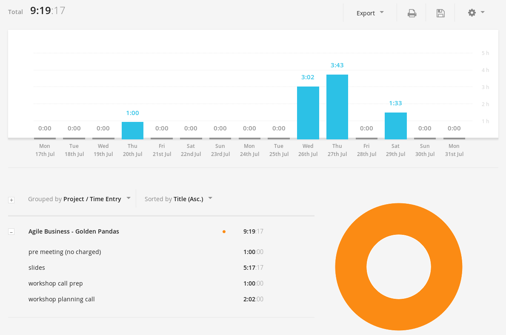

# Agile Workshop

This experiment was a collaboration with Susan Basterfield from Golden Pandas (a livelihood pod in our neighbourhood of the Enspiral super-cluster). She has a long term relationship as a consultant with an organisation in Australia who provide nursing care.

They're in the process of figuring out how to be more flat, and were inspired by the likes of [Buurtzorg](https://www.buurtzorg.com/about-us/) (there is an amazing case study of them in [Reinventing Organisations](http://www.reinventingorganizations.com/)).

Susan and I (mix) got talking about this and decided to pair on the preperation of a workshop about introduce _Agile for Business_.
I have a background doing Agile Software, but also in technical education and art.

## What / How

We set aside a couple of hours and explored the current context of the organisation, and what good next steps might be.
This involved understanding things like :
  - who's in the room
  - what is their capacity
  - what does success look like

I kept notes and facilitated us through this exploration.

Once we'd talked concepts we put together a rough timeline for a 2 hour workshop.
There was some back and forth about how best to balance things like :
- covering theory vs. interactive exercise
- planning content vs. making space for adaptation to meet needs
- intersting exercise vs. need for specialised materials (e.g. lego)

We agreed how to split up some work - my part was to go away and illustrate some slides

This is part of a series looking at the iteration inside The Scientific Method.
It also includes the meta-pattern of iteration of the process - we showed the progression of the 'Natural History Method' (shown above) into the modern Sceintific Method.

## Money

We agreed early on that there was a cap for how much Golden Pandas could afford for this ($500 NZD).
I proposed that I work at an hourly rate of $90/ hour, with a maximum cap of $500.

Like other collaborations with coops and collectives that are values-aligned, my primary motivation is working with excellent people, doing good work, and working to make sure the outcomes were win-win.

## Reflections

Like a lot of early experiments, I tracked my time on this project (to get a more accurate sense of the time costs).

I'm always surprised at how long slides take.
In this case I did barely any post-production on my drawings, ...and still.

Susan and I are going to do a debreif/ retrospective when she returns from Australia.

I'm really interested to know:
  - how'd the workshop go in practice?
    - what were the surprises?
    - did people understand my drawings?
    - how did she find talking to me drawings?
  - do you feel like you got good value from this collaboration
    - did the amount of money feel ok?
    - anything you'd change
  - what feedback do you have fo me?

_TO DO: UPDATE AFTER RETRO!_

