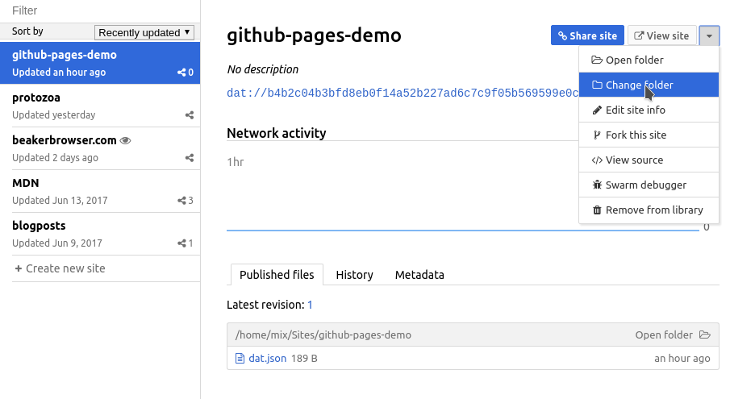
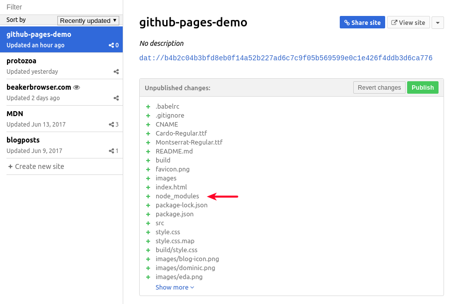
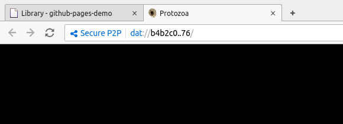
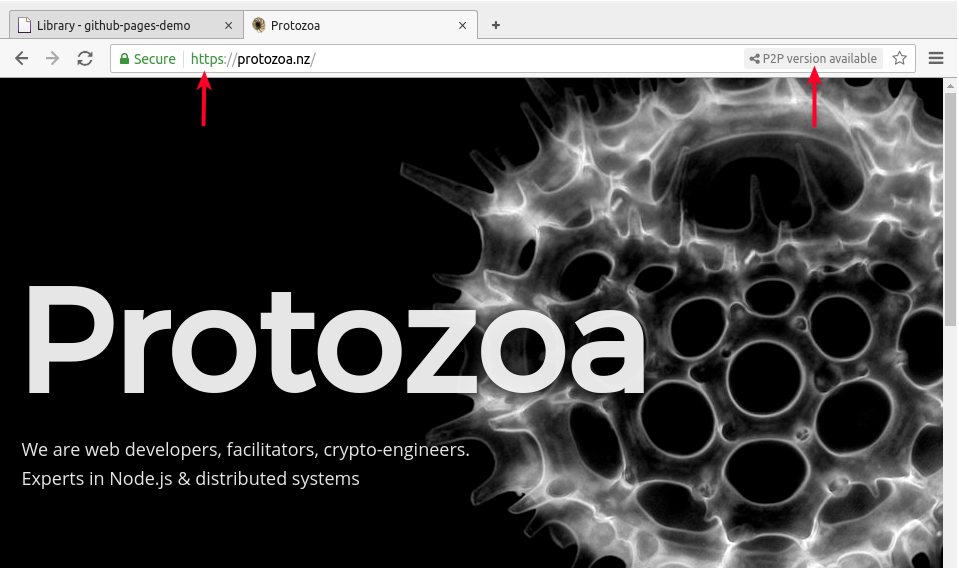
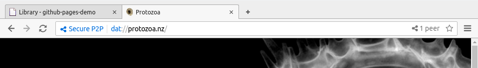

# p2p Github Pages

The great news is that it's easy to have github pages offer up a p2p served alternative when using [Beaker Browser](https://beakerbrowser.com/).
This has the promise of offering a web that is greener, faster, and offline friendly.

<blockquote class="twitter-tweet" data-lang="en"><p lang="en" dir="ltr">I realized today that I can have dat:// support on my github page (at the github.io domain) <a href="https://t.co/yCcaTDdJn1">https://t.co/yCcaTDdJn1</a></p>&mdash; Paul Frazee✌️ (@pfrazee) <a href="https://twitter.com/pfrazee/status/884503302968356864">July 10, 2017</a></blockquote>
<script async src="//platform.twitter.com/widgets.js" charset="utf-8"></script>

The original guide is pretty straightforward.
This is a stepwise guide for people new to Beaker + DAT, and shows you how to make a github page with a **custom domain** p2p friendly.


## Set up https

You need https for Beaker to be able to securely confirm the DAT alternative of your site.
Raw github pages (e.g. protozoa-nz.github.io) come with https by default.
Unfortunately, when you add a custom domain, you lose https (this is an [outstanding issue](https://github.com/isaacs/github/issues/156)).

The simplest solution is to run your DNS through [CloudFlare](https://www.cloudflare.com/). 


I recommend [Steps 2 + 3 of this guide](https://blog.cloudflare.com/secure-and-fast-github-pages-with-cloudflare/#step2settingupourdns).

**Notes**:
- You can skip making a Page Rule (step 3)
- Settings which may have deviated (under Crypto page)
  - SSL: `Full`
  - Allways use HTTPS: `On`
- this can take 24 hours to take effect


## Get your site up on DAT

This assumes you already have a [github pages](https://pages.github.com/) repo.

If you haven't already got the Beaker Browser, go get it [here](https://beakerbrowser.com/docs/install/).
Beaker makes it a piece of cake to browse the p2p web, and also to publish sites there.

(1) Click `New site`

(2) Give it a name and click `Create`

(3) Point Beaker at your github-pages repo (the repo folder on your computer)





**Notice** that Beaker has _staged_ new changes ready to be commited and published and I'm about to publish **way too many files** (like all my `/node_modules` and a messy ol `/build` folder).
You can see the extent of the problem by clicking `Show more` to see how many files you're about to p2p.


Luckily you can add a `.datignore` file to your repo, Mine looks like this 

```
node_modules
build
src
```

(4) Refresh the Beaker page (and click `Show more`) to confirm you're not publishing unwanted files

(5) When you're happy, click `Publish`, then check out your p2p site! (click `View site`)




## Announce your p2p support

This is shockingly easy.

(1) Add a `.well-known` folder (dot needed) with file called `dat` in it. Put your the DAT address of your site in here. My `.well-known/dat` looks like this:

```
dat://e0e7be18ecc7ea95dc7cdbf4fc410049e5f3052ab1446fd9d201f6dab70e44f2/
TTL=3600
```

(2) Make or ammend a `_config.yml` file to your page. Mine looks like this:

```yaml
include: [".well-known"]

```

(3) Push your changes to github, and publish your changes to DAT.

Once your DNS settings have propogated, browsing to your custom domain in Beaker, you should now see this :





Here's a repo I recently put online for reference : https://github.com/protozoa-nz/protozoa-nz.github.io


## Hashbase (optional)

p2p is powerful, AND because it leverages peers, if no peers are online, first time visitors are going to have a hard time.

[Hashbase](https://hashbase.io/) is a super easy to use service which offers peer-as-a-service. You just tell it what DAT repo you want always online, and it makes it so. It also offers a handy https link for any sites you'd like to offer accessible portals to. I'm hoping in the future I'll be able to point my DNS records directly there.


